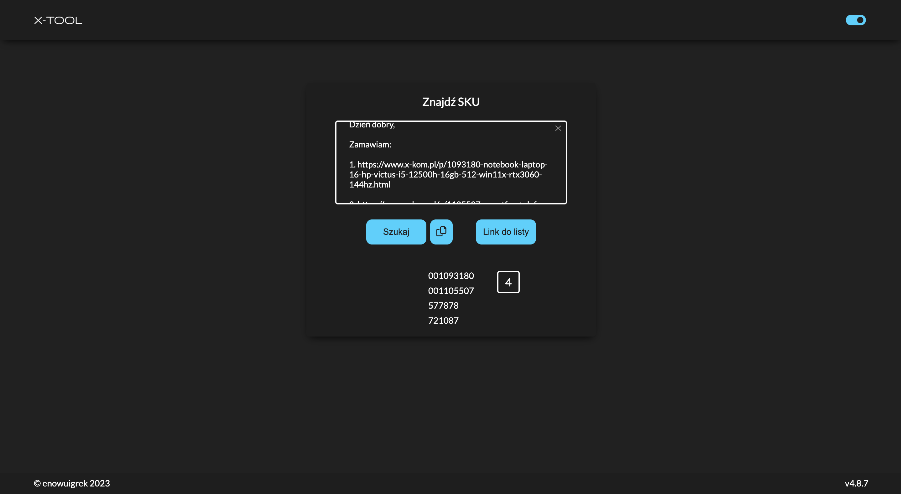
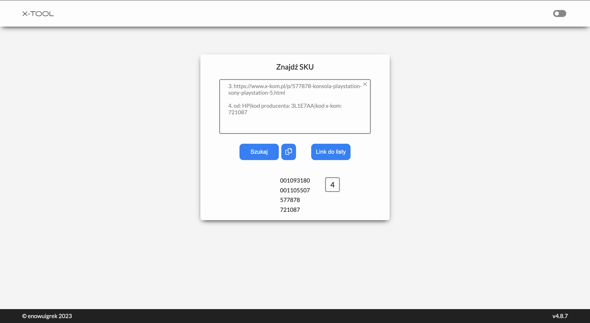

# x-tool

[x-tool](https://x-tool.pl)

x-tool is a browser-based tool written in JavaScript, HTML, and CSS that allows you to search for product SKUs on the x-kom.pl website. The tool enables you to paste a message from a customer that contains links or SKUs of products from x-kom.pl. Upon clicking the "Search" button, x-tool displays the extracted SKUs in a dedicated column. You can easily copy the SKUs and paste them into your sales system to prepare quotes or place orders.

## Technologies Used

* HTML5
* Sass (using CSS preprocessor)
* JavaScript

## Usage

To use x-tool, follow these steps:
* Open the x-tool webpage in your web browser.
* Copy the message from the customer that contains links or SKUs of x-kom.pl products.
* Paste the copied message into the text input field on the x-tool webpage.
* Click the "Search" button.
* x-tool will display the identified SKUs in a dedicated column.
* Click the button that allows you to copy all the SKUs (it features a copy icon). This will copy all the SKUs to your clipboard, allowing you to easily paste them into your sales system.

## Project Status

* Stable

## Screenshots

## Contact

If you have any questions or suggestions regarding x-tool, please contact at enowuigrek@gmail.com